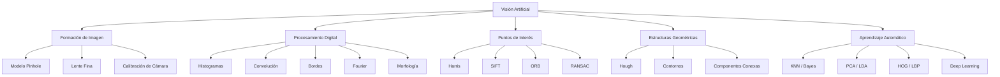

# 👁️ Guía de Iniciación a la Visión Artificial


> **Guía completa de iniciación a la Visión Artificial, orientada al estudio teórico, matemático y práctico de los principales fundamentos de la asignatura.**

Este repositorio contiene una guía en formato PDF diseñada como material de apoyo para el aprendizaje de **Visión Artificial**, especialmente enfocada en estudiantes del **Grado en Inteligencia Artificial** o perfiles técnicos que quieran consolidar las bases de la disciplina.

La guía combina explicaciones conceptuales, formulación matemática, ejemplos numéricos y fragmentos de código en **Python/OpenCV**, con un enfoque especialmente útil para preparar exámenes, repasar conceptos clave y entender la conexión entre la teoría y la implementación práctica.

---

## 📘 Contenido del Repositorio

```bash
.
├── guia_vision_artificial.pdf
└── README.md
````

El documento principal del repositorio es:

📄 **`guia_vision_artificial.pdf`**

Una guía estructurada de más de 140 páginas que recorre los fundamentos esenciales de la visión artificial, desde la formación de imagen hasta técnicas clásicas y modernas de reconocimiento visual.

---

## 💡 Descripción General

La visión artificial permite que los sistemas computacionales interpreten información visual procedente de imágenes o vídeo. Esta guía introduce los conceptos necesarios para comprender cómo se forma una imagen, cómo se procesa digitalmente y cómo se extraen características relevantes para tareas de detección, clasificación y reconocimiento.

El material está pensado para servir como:

* 📚 Apuntes de estudio para exámenes.
* 🧮 Referencia rápida de fórmulas y conceptos.
* 🧪 Apoyo práctico con ejemplos en Python y OpenCV.
* 🧠 Base teórica para proyectos de Computer Vision.
* 📝 Guía de repaso antes de pruebas académicas.

---

## 🧭 Temario Principal

La guía se organiza en cinco bloques fundamentales:

### 1. Fundamentos de Formación de Imagen

Introducción a los principios físicos y geométricos que permiten capturar imágenes digitales.

**Conceptos tratados:**

* Luz, espectro electromagnético y color.
* Propiedades físicas de la luz.
* Representación del color en RGB, HSV, YCbCr/YUV.
* Modelo pinhole.
* Modelo de lente fina.
* Cámara proyectiva.
* Parámetros intrínsecos y extrínsecos.
* Calibración de cámara.
* Distorsiones y aberraciones.
* Sensores CCD/CMOS.
* Patrón de Bayer y demosaicing.
* Imagen digital y memoria.

---

### 2. Operaciones sobre Imágenes

Bloque centrado en el procesamiento digital de imágenes y las transformaciones básicas necesarias para mejorar, analizar o preparar imágenes para etapas posteriores.

**Conceptos tratados:**

* Histogramas.
* Operaciones puntuales.
* Umbralización.
* Normalización.
* Corrección gamma.
* Ecualización del histograma.
* Filtrado espacial.
* Correlación y convolución.
* Filtros lineales y no lineales.
* Detección de bordes.
* Operadores Sobel, Prewitt, Laplaciano y Canny.
* Ruido y suavizado.
* Morfología matemática.
* Transformada de Fourier.
* Transformaciones geométricas.
* Homografías.

---

### 3. Detección y Descripción de Puntos de Interés

Se estudian técnicas clásicas para identificar regiones relevantes de una imagen y describirlas de forma robusta frente a cambios de escala, rotación o iluminación.

**Conceptos tratados:**

* Detector de Harris.
* Detección invariante a escala.
* SIFT.
* FAST.
* MSER.
* BRIEF.
* ORB.
* Matching de descriptores.
* Ratio test.
* RANSAC.
* Bag of Visual Words.

---

### 4. Detección de Estructuras Geométricas

Apartado dedicado a métodos para detectar formas simples y estructuras geométricas dentro de imágenes.

**Conceptos tratados:**

* Transformada de Hough para rectas.
* Hough probabilística.
* Hough para círculos.
* Votación con puntos de interés.
* Acumuladores.
* RANSAC.
* Umbralizado global y adaptativo.
* Componentes conexas.
* Contornos.
* Regiones MSER.

---

### 5. Aprendizaje Automático en Visión Artificial

Introducción a técnicas de reconocimiento visual mediante características clásicas, clasificadores tradicionales y arquitecturas modernas de Deep Learning.

**Conceptos tratados:**

* Fases de un sistema de reconocimiento.
* Clasificación por color.
* Clasificador euclídeo.
* KNN.
* Clasificador Bayesiano.
* K-means.
* PCA y LDA.
* Ensemble Learning.
* Local Binary Patterns.
* Histogram of Oriented Gradients.
* Haar-like features.
* Imagen integral.
* Detección de objetos.
* IoU, precisión, recall, AP y mAP.
* Non-Maximum Suppression.
* Viola-Jones.
* Dalal y Triggs.
* R-CNN, Fast R-CNN y Faster R-CNN.
* Detectores Single Stage.
* Módulo DNN de OpenCV.

---

## 🏗️ Estructura Conceptual



---

## 🧪 Enfoque Práctico

Aunque el repositorio contiene únicamente la guía en PDF, el documento incluye ejemplos y fragmentos de código orientados a la práctica con **Python** y **OpenCV**.

Algunas operaciones presentes en la guía incluyen:

```python
import cv2

img_bgr = cv2.imread("imagen.jpg")

img_rgb = cv2.cvtColor(img_bgr, cv2.COLOR_BGR2RGB)
img_gray = cv2.cvtColor(img_bgr, cv2.COLOR_BGR2GRAY)
img_hsv = cv2.cvtColor(img_bgr, cv2.COLOR_BGR2HSV)
```

También se trabajan operaciones habituales como:

* lectura y conversión de imágenes;
* aplicación de filtros;
* detección de bordes;
* transformaciones geométricas;
* extracción de características;
* evaluación de detectores;
* uso de funciones clave de OpenCV.

---

## 🛠️ Tecnologías y Herramientas Tratadas

* **Python** — lenguaje principal para los ejemplos prácticos.
* **OpenCV** — biblioteca central para procesamiento de imágenes.
* **NumPy** — operaciones matriciales y manipulación de arrays.
* **Matemáticas aplicadas** — álgebra lineal, geometría proyectiva, convolución y transformadas.
* **Machine Learning** — clasificadores clásicos y reducción de dimensionalidad.
* **Deep Learning** — introducción a arquitecturas modernas de detección.

---

## 🎯 Objetivos de la Guía

Esta guía tiene como objetivo facilitar una comprensión sólida de los fundamentos de la visión artificial.

Al finalizar su estudio, el lector debería ser capaz de:

* comprender cómo se forma una imagen digital;
* diferenciar modelos de cámara como pinhole y lente fina;
* interpretar parámetros intrínsecos y extrínsecos;
* aplicar operaciones básicas de procesamiento de imagen;
* distinguir entre filtros lineales y no lineales;
* utilizar técnicas de detección de bordes;
* entender la Transformada de Fourier aplicada a imágenes;
* aplicar conceptos de morfología matemática;
* reconocer detectores y descriptores de puntos de interés;
* comprender la Transformada de Hough;
* interpretar métricas de evaluación en detección de objetos;
* conectar técnicas clásicas con métodos modernos de Deep Learning.

---

## 📊 Resumen de Contenidos

| Bloque | Tema                    | Enfoque                                             |
| ------ | ----------------------- | --------------------------------------------------- |
| 1      | Formación de imagen     | Cámara, luz, color, sensores y proyección           |
| 2      | Procesamiento de imagen | Histogramas, filtros, bordes, Fourier y morfología  |
| 3      | Puntos de interés       | Harris, SIFT, ORB, matching y RANSAC                |
| 4      | Estructuras geométricas | Hough, contornos y componentes conexas              |
| 5      | Aprendizaje en visión   | Clasificadores, HOG, LBP, detección y Deep Learning |
| 6      | OpenCV práctico         | Chuleta de funciones y plantillas de código         |
| 7      | Examen                  | Preguntas tipo y checklist final                    |

---

## 🚀 Cómo Usar Este Repositorio

### 1. Clonar el repositorio

```bash
git clone https://github.com/Hugo31810/guia-vision-artificial.git
cd guia-vision-artificial
```

### 2. Abrir la guía

Puedes abrir directamente el PDF:

```bash
guia_vision_artificial.pdf
```

También puedes visualizarlo desde GitHub haciendo clic sobre el archivo en el repositorio.

---

## 📌 Recomendaciones de Estudio

Para aprovechar mejor la guía:

1. Comienza por el bloque de **formación de imagen**, ya que sirve como base para comprender la geometría de cámara.
2. Repasa las operaciones de imagen junto con ejemplos prácticos en OpenCV.
3. Memoriza las diferencias entre filtros, detectores y descriptores.
4. Practica ejercicios de convolución, umbralización, Fourier y morfología.
5. Utiliza los resúmenes de examen como checklist final antes de una prueba.

---

## 👨‍💻 Autor

**Hugo Salvador Aizpún**
*Grado en Inteligencia Artificial*

Enfoque académico: **Visión Artificial, Machine Learning y procesamiento de imagen**.

[GitHub Profile](https://github.com/Hugo31810)

---

## 📄 Licencia

Este repositorio contiene material académico elaborado con fines educativos.

Puedes utilizarlo como recurso de estudio, referencia o apoyo para proyectos relacionados con visión artificial, citando adecuadamente al autor cuando corresponda.

---

## ⭐ Nota Final

Si esta guía te resulta útil para estudiar Visión Artificial, preparar exámenes o repasar fundamentos de Computer Vision, considera dejar una estrella al repositorio.

```
```
